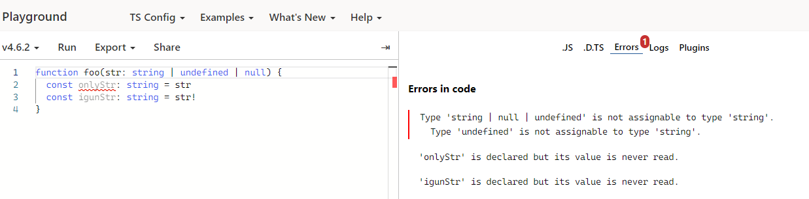
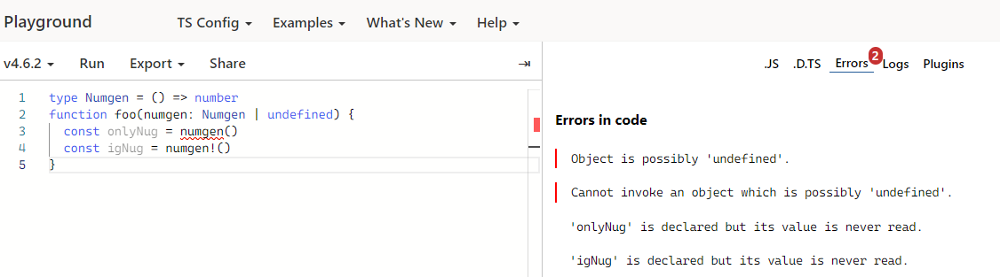
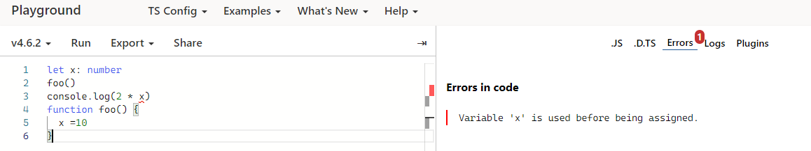
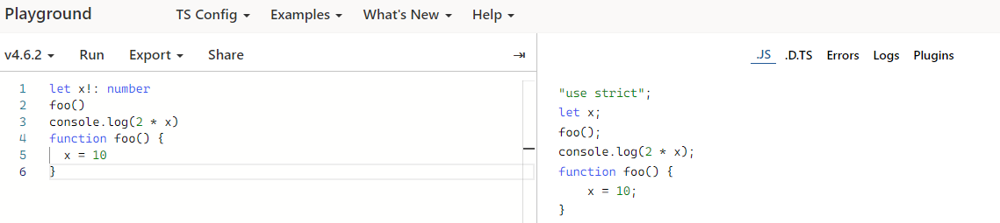

# TypeScript 断言

> 类型断言没有运行时的影响，只是在编译阶段起作用

## 非空断言

> 将检测器无法断定类型时，可以用后缀表达式操作符 `!`

- `!` 可用于断言操作对象是 `非null` 和 `非nudefined`
- `x!` 将从 `x` 值域中排除 `null` 和 `undefined`

  ***1.忽略 `undefined` 和 `null` 类型***

  ```ts
  function foo(str: string | undefined | null) {
    const onlyStr: string = str
    const igunStr: string = str!
  }
  ```

  
  ***2.调用函数时忽略 `undefined` 类型***

  ```ts
  type Numgen = () => number
  function foo(numgen: Numgen | undefined) {
    const onlyNug = numgen()
    const igNug = numgen!()
  }
  ```

  

  :::warning 注意项
  > 非空断言操作符会从编译生成的 `js` 代码中移除，在实际开发中需要特别注意
  :::
  示例：

  ```ts
  const a: number | undefined = undefined
  const b: number = a!
  console.log(b)
  ```

  `TS` 编译后的 `JS` 代码

  ```js
  const a = undefined
  const b = a
  console.log(b) // undefined
  ```

  ***3.确定赋值断言***
  > 允许在实例属性和变量声明后面放置 `!` 号，是用来告诉 `TS` 该属性会被明确地赋值

  ```ts
  let x: number
  foo()
  console.log(2 * x) // 报错变量'x'在被赋值之前被使用
  function foo() {
    x = 10
  }
  ```

  
  要解决这个问题，可以使用确定赋值断言

  ```ts
  let x!: number
  foo()
  console.log(2 * x)
  function foo() {
    x = 10
  }
  ```

  

## as 语法

```ts
const str: any = '断言'
const leng: number = (str as string).length
```

## 尖括号语法

```ts
const str: any = '断言'
const leng: number = (<string>str).length
```
