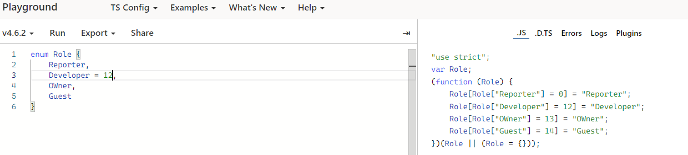
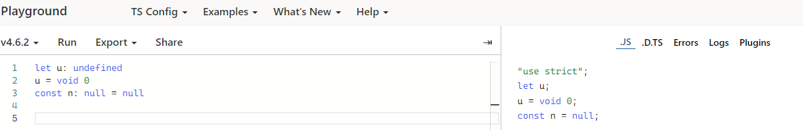

# TypeScript 基础类型

## Boolean

> 布尔(/ˈbuːliən/) 类型 值就是true/false值，在 `js` 和 `ts` 里叫做 `boolean`

```ts
const isShow: boolean = true
```


:::tip 成功代码
类型检测编译通过
:::

```ts
const isShow: boolean = 'true'
```


:::warning 错误信息
类型'string'不能赋给类型'boolean'。
:::

## Number

> 数字(/ˈnʌmbər/) 在 `ts` 里都是浮点数，所以浮点的类型是 `number`，还支持二、八、十、十六进制字面量

```ts
const count: number = 66
const binary: number = 0b1010
const octal: number = 0o744
const hex: number = 0xf00d
```


## String

> 字符串(/strɪŋ/ ) `string` 表示文本类型数据，可以用单引号 `''` 或双引号 `""` 及模板字符 `(``)`

```ts
const title: string = '学习TS'
const text: string = `今天在${title}`
```


## Symbol

> `symbol` (/ˈsɪmbl/) 是唯一不可变的值，他的值是通过 `Symbol` 的构造函数创建的
  
```ts
const sym1: symbol = Symbol()
const sym2 = Symbol()
sym1===sym2
```

`run: false`

## Array

> 数组(/əˈreɪ/) 类型有两种定义方式

- 在元素类型后面接上 `[]` 表示由此类型元素组成一个数组
- 使用数组泛型定义，`Array<元素类型>`

  ```ts
  const list: number[] = [1,2,3]
  const itmes: Array<string> = ['1','2','3']
  ```

  

## Enum

> 枚举(/'enəm/) 类型是一组具有名字的集合，可以定义一些带名字的常量，默认为数字枚举，开发中一般用来管理维护硬编码和其他固定常量值

### 数字枚举

- 数字枚举第一个成员默认初始值为`0`，其他成员值从`1`依次递增
- 当为某个成员赋值时，且只能是数字，后面成员将从当前成员赋的值依次递增
- 数字枚举除了把成员名称映射为成员值外，还能将成员值反向映射为成员名称

  ```ts
  enum Role {
    Reporter,
    Developer,
    Maintainer,
    OWner,
    Guest
  }
  ```

  
  
  将上面定义的Role数字枚举代码编译为 `js`

  ```js
  var Role;
  (function (Role) {
      Role[Role["Reporter"] = 0] = "Reporter";
      Role[Role["Developer"] = 1] = "Developer";
      Role[Role["Maintainer"] = 2] = "Maintainer";
      Role[Role["OWner"] = 3] = "OWner";
      Role[Role["Guest"] = 4] = "Guest";
  })(Role || (Role = {}));
  ```

  运行以上 `js` 代码

  ```json
  {
    "0": "Reporter",
    "1": "Developer",
    "2": "Maintainer",
    "3": "OWner",
    "4": "Guest",
    "Reporter": 0,
    "Developer": 1,
    "Maintainer": 2,
    "OWner": 3,
    "Guest": 4
  }
  ```

### 字符串枚举

- 在字符串枚举中，每一个成员必须用字符串字面量
- 纯字符串枚举，不能省略任何一个成员初始值，不能将成员值反向映射为成员名称

  ```ts
  enum Role {
    Reporter = 'Reporter',
    Developer = 'Developers',
    OWner = 'OWner',
    Guest = 'Guest'
  }
  ```

  
  将上面定义的Role数字枚举代码编译为 `js`

  ```js
  var Role;
  (function (Role) {
      Role["Reporter"] = "Reporter";
      Role["Developer"] = "Developers";
      Role["OWner"] = "OWner";
      Role["Guest"] = "Guest";
  })(Role || (Role = {}));
  ```

  运行以上 `js` 代码

  ```json
  {
    "Reporter": "Reporter",
    "Developer": "Developers",
    "OWner": "OWner",
    "Guest": "Guest"
  }
  ```

### 常量枚举

- 常量枚举通过关键字 `const` 来定义
- 常量枚举使用内联语法，不会编译为任何 `js` 代码；从而减少代码体积

  ```ts
  const enum Role {
    Reporter = 'Reporter',
    Developer = 'Developers',
    OWner = 'OWner',
    Guest = 'Guest'
  }
  const roleName: Role = Role.Developer
  ```

  

### 异构枚举

- 异构枚举的成员值是数字和字符串的混合
- 其中数字的成员值具有数字枚举特性

  ```ts
  enum Role {
    Reporter = 'Reporter',
    Developer = 1002,
    OWner = 1901,
    Guest = 'Guest'
  }
  ```

  

## Any

- `any` ( /ˈeni/) 是类型系统的一个逃逸舱，也称为全局超级类型

  ```ts
  let nots: any = 'ts'
  nots = 12
  nots = true
  nots = {}
  nots = []
  ```

  

## Unknown

> `nuknown` (/ˌʌnˈnoʊn/) 不可预先定义的类型，它可以替代 `any` 的功能同时保留静态检查的能力

- `unknown` 类型只能赋值给 `any` 类型和 `unknown` 类型本身

  ```ts
  let value: unknown
  value = 'ts'
  value = true
  value = 21
  value = undefined
  value = null
  value = []
  value = {}
  ```

  
  :::danger 错误信息：
  - 类型'unknown'不能赋给类型'string'。
  - 类型“unknown”不能分配给类型“number”。
  :::
  

- 在静态编译时候 `unknown` 不能调用任何方法，而 `any` 可以

  ```ts
  const foo: unknown = 'ts'
  foo.substr(1) // 静态检查不通过
  const bar: any = 10
  bar.substr(1) // any类型相对于放弃了静态检查
  ```

  

- 避免使用 `any` 作为函数的参数类型而导致的静态类型检查出BUG

  ```ts
  function test(val: unknown): number {
    if (Array.isArray(val)) {
      return val.length // 类型守卫已经将val识别出是array类型
    }
    return val.length // 这里val还是unknown类型，静态检查报错
  }
  ```

  

  :::warning 如果是any类型则通过

  ```ts
  function test(val: any): number {
    if (Array.isArray(val)) {
      return val.length
    }
    return val.length
  }
  ```

  :::

## Tuple

> 元组(/ˈtʌpəl/) 类型在单个变量中存储不同的类型的值，用来定义有限数量的未命名属性的类型

- 每个属性都有一个关联的类型，元祖初始化时候，必须提供每一个属性的值
- 通过下标来访问元组中的元素

  ```ts
  let tupleStype: [string, number]
  tupleStype = ['ts', 12]
  ```

  
  :::danger 错误信息：
  - 类型'string'不能分配给类型'number'。
  - 类型“[string]”不能分配给类型“[string, number]”，目前给有1个元素，而实际是需要2个。
  - 类型“[string, number, number]”不能分配给类型“[string, number]”，目前有3个元素，但是实际只允许2个
  :::
  

## Void

- `void` (/vɔɪd/) 表示没有任何类型， 通常用在函数没有返回值类型的声明
- 声明一个 `void` 类型的变量没有什么用，在严格模式下，他的值只能是 `undefined`
- `void` 和 `undefined` 功能高度类似，可以在逻辑上避免不小心使用了空指针导致的错误
- 区别可以理解为 `undefin` 是 `void` 的一个子集

  ```ts
  function warnUse(): void {
    console.log('这是没有返回值的函数')
  }
  const unusable: void = undefined
  ```

  

## Null 与 Undefined

> TypeScript里 `Undefined` (/ˌʌndɪˈfaɪnd/) 和 `Null` (/nʌl/) 类型分别为 `undefined` 和 `null`

  ```ts
  let u: undefined
  u = void 0
  const n: null = null
  ```

  

## Object

***1.小写object 类型***

- `object` (/ˈɑːbdʒɪkt/) 类型用来表示非原始类型

  ```ts
  interface ObjectConstructor {
    create(o: object | null): any
  }
  Object.create({})
  Object.create(null)
  Object.create(undefined)
  Object.create('123')
  Object.create(true)
  Object.create(1)
  ```

  :::danger 错误信息：
  - 类型“undefined”的参数不能赋值给类型“| null”的参数。
  - 类型为'string'的参数不能赋给类型为'object'的参数。
  - boolean类型的参数不能赋值给object类型的参数。
  - 类型“number”的参数不能赋给类型“object”的参数。
  :::
  

***2.大写Object 类型***

> `Object` 类型是有所 `Object` 类的实例类型，由两个接口来定义

- `Object` 接口定义了 `Object.prototype` 原型对象属性

  ```ts
  interface Object {
    constructor: Function
    toString(): string
    toLocaleString(): string
    valueOf(): Object
    hasOwnProperty(v: PropertyKey): boolean
    isPrototypeOf(v: Object): boolean
    propertyIsEnumerable(v: PropertyKey): boolean
  }
  ```

  

- `ObjectConstructor` 接口定义了 `Object` 类的属性
- `Object` 类中所有实例都继承了 `Object` 接口中的所有属性

  ```ts
  interface ObjectConstructor {
    new(value?: any): Object
    (value?: any): any
    readonly prototype: Object
    getPrototypeOf(o: any): any
    // ...
  }
  declare var Object: ObjectConstructor
  ```

  

***3.花括号{} 类型***

- `{}` 类型是描述一个没有成员的对象
- 在 `{}` 类型上定义所有属性和方法，这些属性和方法是通过原型链隐式地使用

  ```ts
  const obj = {}
  obj.toString()
  obj.str = 'xxx'
  ```

  :::danger 错误信息：
  - 类型“{}”上不存在属性“str”
  :::
  

## Never

> `never` (/ˈnevər/) 类型表示永远不存在的值的类型

- 抛异常不会用返回值的函数表达式

  ```ts
  function error(msg: string): never {
    throw new Error(msg)
  }
  function initLoop(): never {
    while(true) {}
  }
  ```

  

- `never` 类型全面性检查, 避免出现新增了联合类型没有对应的实现，目的就是写出类型绝对安全的代码

  ```ts
  type Foo = string | number | boolean
  function testNever(foo: Foo) {
    if (typeof foo === 'string') {
      // string 类型代码逻辑
    } else if (typeof foo === 'number') {
      // number 类型代码逻辑
    } else {
      const check: never = foo
      // never 类型代码逻辑 
    }
  }
  ```

  :::danger 错误信息：
  - 类型'boolean'不能赋给类型'never'；'check'声明了，但它的值永远不会被读取。
  :::
  
