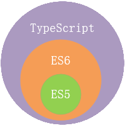
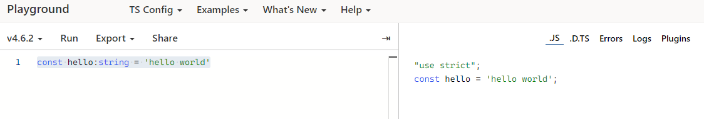

# TypeScript 介绍

## TypeScript 语言

:::info TypeScript是JavaScript类型的超级，它可以编译成纯的JavaScript

- TypeScript 是由微软开发的自由和开源的编程语言
- TypeScript 语言添加了了选的静态类型和基于类型的面向对象编程
:::

**TypeScript 与 ES5、ES6 之间的关系**

**TypeScript 与 JavaScript 的区别**
| JavaScript | TypeScript |
| :-----| ----: |
| 作为一种解释型语言，只能在运行时发行错误 | 可以在编译时发现错误并纠正错误 |
| 弱类型，没有静态类型选项 | 强类型，支持静态和动态类型 |
| 可以直接在浏览器中使用 | 需要编译成javascript代码，浏览器才能理解 |
| 不支持模块、泛型、接口 | 支持模块、泛型、接口 |

## 安装 TypeScript

> TypeScript 编译器可以用 pnpm | yarn | npm 包管理器来安装

```cmd
npm i typescript -g
npm i typescript -g --registry https://registry.npm.taobao.org

cmd> npm i typescript -g --registry https://registry.npm.taobao.org
changed 1 package in 9s
```

## 验证 TypeScript

```cmd
cmd>tsc -v
Version 4.6.2
```

## 编译上下文

```code
code>tsc --init
Created a new tsconfig.json
```

tsconfig.json 的作用

- 用于标识 TypeScript 项目的根路径
- 用于配置 TypeScript 编译器
- 用于指定编译文件

[tsconfig.json 重要字段](https://juejin.cn/post/6844904178234458120)

- files: Array 设置需要编译的文件名称
- include: Array 数组设置需要编译的文件，支出路径模式匹配
- exclude: Array 设置不需要编译的文件，支出路径模式匹配
- extends: string 继承配置文件
- compilerOptions: Object 设置编译流程相关配置

compilerOptions 配置项[moduleResolution](https://www.typescriptlang.org/docs/handbook/module-resolution.html)

```json
"compilerOptions": {
  // "incremental": true,                   /* 启动增量编译，可以提升编译速度 */
  // "composite": true,                     /* 工程可以被引用并且可以增量编译 */
  // "tsBuildInfoFile": "./",               /* 存储增量编译文件路径*/
  // "diagnostice": true,                   /* 打印诊断信息 */

  "target": "es2016",                       /* 指定目标语言版本 默认 'ES3'*/
  // "lib": [],                             /* 指定要包含在编译中的库文件 */
  // "outDir": "./",                        /* 指定输入目录 */
  // "outFile": "./",                       /* 将多个互相依赖文件生成一个文件，可用AMD模块中 */
  // "allowJs": true,                       /* 运行编译js文件（js、jsx） */
  // "checkJs": true,                       /* 允许在js文件中报错，通常与allowJs一起用 */
  // "removeComments": true,                /* 删除注释 */
  // "jsx": "preserve",                     /* 指定jsx代码生成 */

  "module": "commonjs",                     /* 指定生成模块标准 */
  // "rootDir": "./",                       /* 指定输出文件目录结构 */
  // "moduleResolution": "node",            /* 指定模块解析策略 ["classic" : "node"]*/
  // "baseUrl": "./",                       /* 解析非相对模块的基地址 */
  // "paths": {                             /* 路径映射，相对于baseUrl */
  //   "jquery": ["node_modules/jquery/xx.sx.main.js"]
  // },                                      
  // "rootDirs": ["src","out"],             /* 将多个目录放在一个虚拟目录下运行时结构内容 */
  // "typeRoots": [],                       /* 声明文件目录，默认node_modules/@type */
  // "types": [],                           /* 声明文件包 */
  // "declaration": true,                   /* 生成声明文件 */
  // "declarationDir": "./",                /* 声明文件路径 */
  // "declarationMap": true,                /* 生成声明文件的 sourceMap */
  // "emitDeclarationOnly": true,           /* 只生成声明文件 */
  // "sourceMap": true,                     /* 生成目标文件的 sourceMap */
  // "inlineSourceMap": true,               /* 生成目标文件的依赖 sourceMap */
  // "noEmitHelpers": true,                 /* 不生成helper函数，需额外安装ts-helpers（优化代码生成体积） */
  // "importHelpers": true,                 /* 通过tslib引入helper函数，文件必须是模块（解决额外安装ts-helpers） */

  "strict": true,                           /* 开启所有严格类型检查 */
  // "alwaysStrict": true,                  /* 在代码中注入'use strict' */
  // "noImplicitAny": true,                 /* 不允许隐式的any类型*/
    // "strictNullChecks": true,            /* 不允许把null、undefined赋值给其他类型变量 */
  // "strictFunctionTypes": true,           /* 不允许函数参数双向协变 */
  // "strictBindCallApply": true,           /* 严格的bind/call/apply检查 */
  // "strictPropertyInitialization": true,  /* 类的实例属性必须初始化 */
  // "noImplicitThis": true,                /* 不允许this有隐式的any类型 */
  // "noUnusedLocals": true,                /* 检查只声明，未使用的局部变量 */
  // "noUnusedParameters": true,            /* 检查未使用的函数参数 */
  // "noFallthroughCasesInSwitch": true,    /* 防止switch语句贯穿 */
  // "noImplicitReturns": true,             /* 每个分支都要有返回值 */

  "esModuleInterop": true,                  /* 允许export，import引用文件 */
  // "allowUmdGlobalAccess": true           /* 允许在模块中间访问UMD全局变量 */
  // "listEmittedFiles": true,              /* 打印输入的文件 */
  // "listFiles": true                      /* 打印输出的文件包括引用的声明文件 */

  // "noEmit": true,                        /* 不输出文件 */
  // "noEmitOnError": true,                 /* 发生错误时不输入文件 */
  // "downlevelIteration": true,            /* 降级遍历器的实现（es3/5） */
  // "experimentalDecorators": true,        /* 启用装饰器 */
  // "emitDecoratorMetadata": true,         /* 为装饰器提供元数据支持 */
  // "jsxFactory": "",                      /* 定义 jsx 工厂方法 */

  "forceConsistentCasingInFileNames": true, /* 不允许不同变量来代表同一文件 */
  "skipLibCheck": true                      /* 对库定义文件跳过类型检查 */
}
```

```code
tsc hello.ts
hello.ts => hello.js
```


[训练场](https://www.typescriptlang.org/play)
