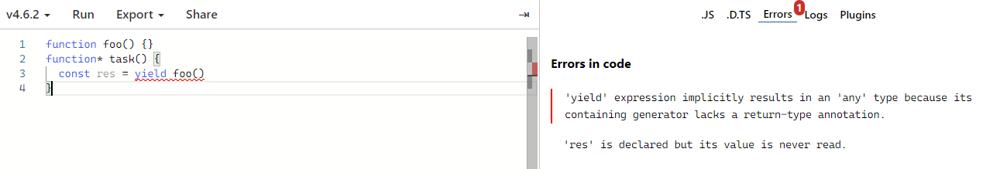
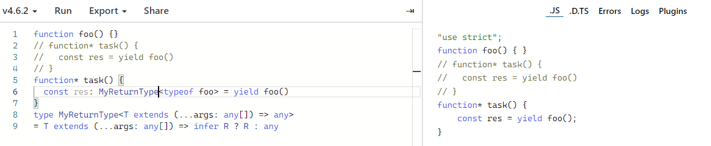

# TS 类型表达中常用的关键字

## extends

***1. 用于类型的继承***

```ts
interface Person {
  name: string
  age: number
}
interface Player extends Person {
  item: '球' | '跑步'
}
```

***2. 判断是否是能赋值给另一个类型***

```ts
// 如果T可以满足类型Person则返回Person类型，否则为T类型
type IsPerson<T> = T extends Person ? Person : T
```

## typeof

> `typeof` 可以用于从一个变量上获取它的类型

```ts
const data = {
  value: 123,
  text: 'text',
  subData: {
    value: false
  }
}
type Data = typeof data
// type Data = {
//   value: number
//   text: string
//   subData: {
//     value: boolean
//   }
// }
```

## keyof

> `keyof` 是索引类型查询操作符；`keyof T` 会得到由 `T` 上已知的公共属性名组成的联合类型。

```ts
interface Person {
  name: string
  age: number
  tel: string
}
type PersonProperty = keyof Person
// type personProperty = 'name' | 'age' | 'tel'

```

```ts
function getProperty<T, K extends keyof T>(obj: T, key: K): T[K] {
  return obj[key]
}
// function getProperty(obj, key) {
//   return obj[key]
// }
```

## in

> `in` 操作符用来遍历目标类型公开属性名，类似 `for .. in` 的机制

***1.枚举类型***

```ts
enum Letter {
  A,
  B,
  C
}
type LetterMap = {
  [key in Letter]: string
}
// type LetterMap = {
//   0: string
//   1: string
//   2: string
// }
```

***2.联合类型***

```ts
type Property = 'name' | 'age' | 'tel'
type PropertyObject = {
  [key in Property]: string
}
// type PropertyObject = {
//   name: string
//   age: string
//   tel: string
// }
type ToString<T> = {
  [key in keyof T]: string
}
// 复制类型工具
type CopyTos<T> = {
  [key in keyof T]: T[key]
}
interface Person {
  name: string
  age: number
}
type Persons = CopyTos<Person>
```

***基础类型***
> 基础类型(string, number, symbol) 也可以用与 `in` 操作符

```ts
type StringKey = {
  [key in string]: any
}
// type StringKey = {
//   [x: string]: any
// }
type NumberKey = {
  [key in number]: any
}
// type NumberKey = {
//   [x: number]: any
// }
type SymbolKey = {
  [key in symbol]: any
}
```

## infer

> `infer` 操作符，用来进行类型推测
在 `task` 迭代生成器函数中使用 `yield` 表达式就会丢失类型

```ts
function foo() {}
function* task() {
  const res = yield foo()
}
```

:::danger 错误信息：
'yield'表达式会隐式地生成'any'类型，因为它所包含的生成器缺少return-type注释。
:::

解决 `return-type` 报错问题，TS内置了 `ReturnType` 的映射类型

```ts
function* task() {
  const res: ReturnType<typeof foo> = yield foo()
}
// 自定义 ReturnType
type MyReturnType<T extends (...args: any[]) => any> = T extends (...args: any[]) => infer R ? R : any
```


[深入理解 TypeScript](https://jkchao.github.io/typescript-book-chinese/tips/infer.html#%E4%BB%8B%E7%BB%8D)

## is

> `is` 操作符是一种类型保护方式

```ts
function isString(value: any): value is string {
  return typeof value === 'string'
}
function foo(value: string | number) {
  if (isString(value)) {
    // 这块分支中value 是string 类型的参数(这就是类型保护)
  } else {
    // 这块分支中value 是number 类型参数
  }
}
// 这样做的好处是实现了代码复用，实现了更好的语义化
interface MyArray {
  isArray(arg: any): arg is Array<any>
}
```
