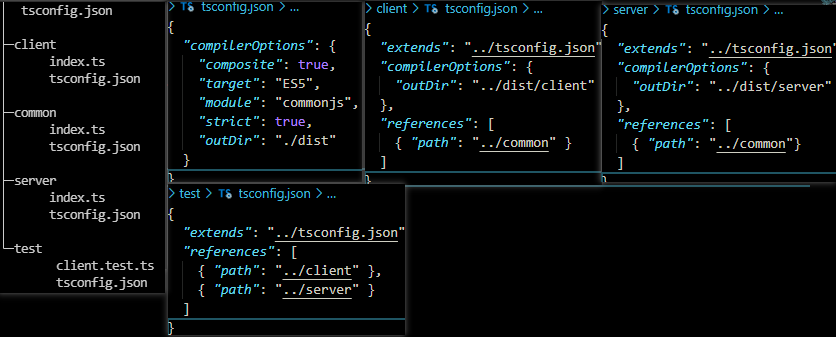
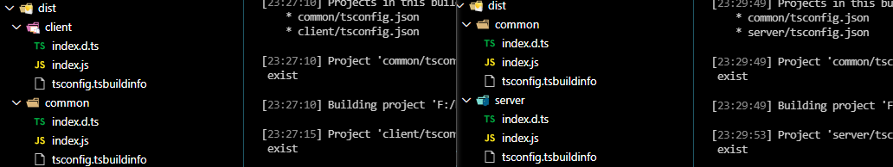

# TypeScript 搭建

## tsconfig.json 工程引用

:::tip 多个工程tsconfig.json 引用

- references：Arrary 依赖配置项
- composite: boolean 工程可以被引用并支持增量编译
:::

**多个工程共用外层公共 tsconfig.json 配置**


```code
cmd>tsc -b client --verbose
cmd>tsc -b server --verbose
```


