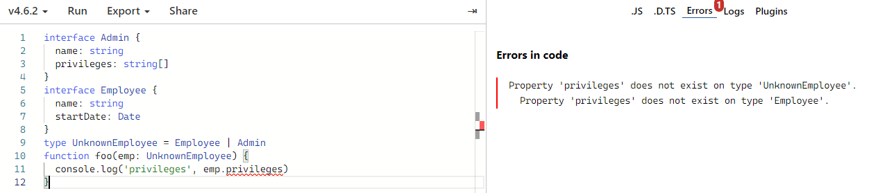

# 类型守卫

> 类型保护是可执行运行时检查的一种表达式，用于确保该类型在一定范围内；也就是说类型保护可以保证一个字符串就是一个字符串，尽管它的值也是一个数值。
> 类型保护与特性检测并不是完全不同，其主要思想是尝试检测属性、方法和原型，已确定如何处理值

## in

```ts
interface Admin {
  name: string
  privileges: string[]
}
interface Employee {
  name: string
  startDate: Date
}
type UnknownEmployee = Employee | Admin
function foo(emp: UnknownEmployee) {
  console.log('name', emp.name)
  if ('privileges' in emp) {
    console.log('privileges', emp.privileges)
  }
  if ('startDate' in emp) {
    conosle.log('startDate', emp.startDate)
  }
}
```

以上代码文稿中接口类型都有相同的字段检查才能通过，比如 `name`

```ts
function foo(emp: UnknownEmployee) {
  console.log('privileges', emp.privileges)
}
```

:::danger 错误信息：
类型“Employee”上不存在属性“privileges”。
:::



## typeof

```ts
function foo(value: string, padding: string | number) {
  if (typeof padding === 'number') {
    return Array(padding + 1).join(' ') + value
  }
  if (typeof padding === 'string') {
    return padding + value
  }
  throw new Error(`${padding}期望是字符串或数字`)
}
```

:::warning typeof 类型保护两种形式

- typeof v === typename
- typeof v !== typename
- typename 必须是“string”|“number”|“bigint”|“boolean”|“symbol”|“undefined”|“object”|“function”。
:::

## instanceof

```ts
interface Padder {
  getPaddingString(): string
}
class SpaceRepeatingPadder implements Padder {
  constructor(private sum: number) {}
  getPaddingString() {
    return Array(this.sum + 1).join(' ')
  }
}
class SpacePadder implements Padder {
  constructor(private value: string) {}
  getPaddingString() {
    return this.value
  }
}
const padder: Padder = new SpaceRepeatingPadder(6)
if (padder instanceof SpaceRepeatingPadder) {
  // padder 的类型收窄为 SpaceRepeatingPadder
}
```

## is

> 自定义类型保护的类型谓词

```ts
function isNumber(x: any): x is number {
  return typeof x === 'number'
}
function isString(x: any): x is string {
  return typeof x === 'string'
}
```
