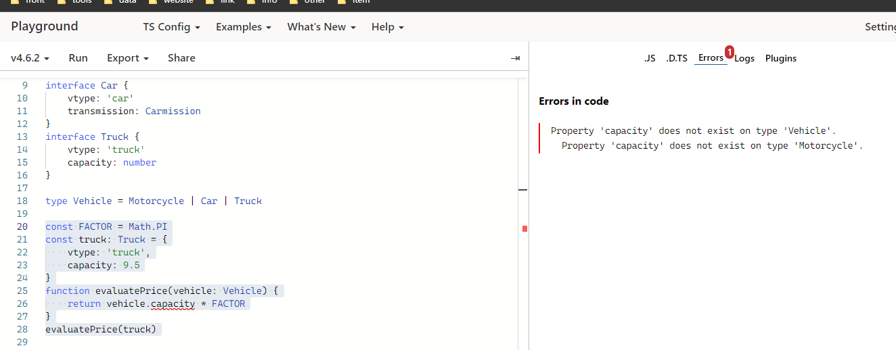

# 联合类型和类型别名

## 联合类型

> 联合类型通常与 `null` 或 `undefined` 一起使用

```ts
const foo = (name: string | undefined) => {}
foo('TS')
foo(undefined)

const num: 1 | 2 = 1
type EvenNames = 'click' | 'scroll' | 'mousemove'
// 定义字面量类型，用来约束取值只能是某几个值中的一个
```

## 可辨识联合

> typeScript 可辨识联合类型，也称为代数数据类型或标签联合类型; 它包含3个要点：`可辨识`、`联合类型`、`类型守卫`。如果一个类型是多个类型的联合类型，且多个类型含有一个公共属性，那么就可以利用这个公共属性来创建不同的类型保护区块。

***1.可辨识***
> 可辨识只要求联合类型中的每个元素都含有一个单列类型属性

```ts
enum Carmission {
  automatic = 200,
  manual = 300
}
interface Motorcycle {
  vtype: 'motorcycle'
  make: number
}
interface Car {
  vtype: 'car'
  transmission: Carmission
}
interface Truck {
  vtype: 'truck'
  capacity: number
}
```

在上面代码文稿中分别定义了 `Motorcycle`、`Car`、`Truck` 三个接口类，每个接口类中都包含一个属性 `vtype`，该属性被称为可辨识属性，而其他的属性只跟特性的接口相关。

***2.联合类型***

基于上面代码文稿中定义的三个接口类，再创建一个 `Vehicle` 联合类型。

```ts
type Vehicle = Motorcycle | Car | Truck
```

`Vehicle` 联合类型就可以使用了，对于 `Vehicle` 类型的变量，它可以表示不同类型的车辆。

***3.类型守卫***

定义一个 `evaluatePrice` 方法，该方法用于根据车辆的类型、容量和评估因子来计算价格

```ts
const FACTOR = Math.PI
const truck: Truck = {
    vtype: 'truck',
    capacity: 9.5
}
function evaluatePrice(vehicle: Vehicle) {
    return vehicle.capacity * FACTOR
}
evaluatePrice(truck)
```

:::danger 错误信息
Motorcycle 接口中不存在 capacity 属性
:::


解决上面报错问题，可以使用 `switch` 和 `case` 运算符来实现类型守卫

```ts
function evaluatePrice(vehicle: Vehicle) {
  switch(vehicle.vtype) {
    case 'car':
      return vehicle.transmission * FACTOR
    case 'truck':
      return vehicle.capacity * FACTOR
    case 'motorcycle':
      return vehicle.make * FACTOR 
  }
}
```

## 类型别名

> 类型别名用来给一个类型起个新名字

```ts
type Message = string | string[]
const greet = (message: Message) => message
```
